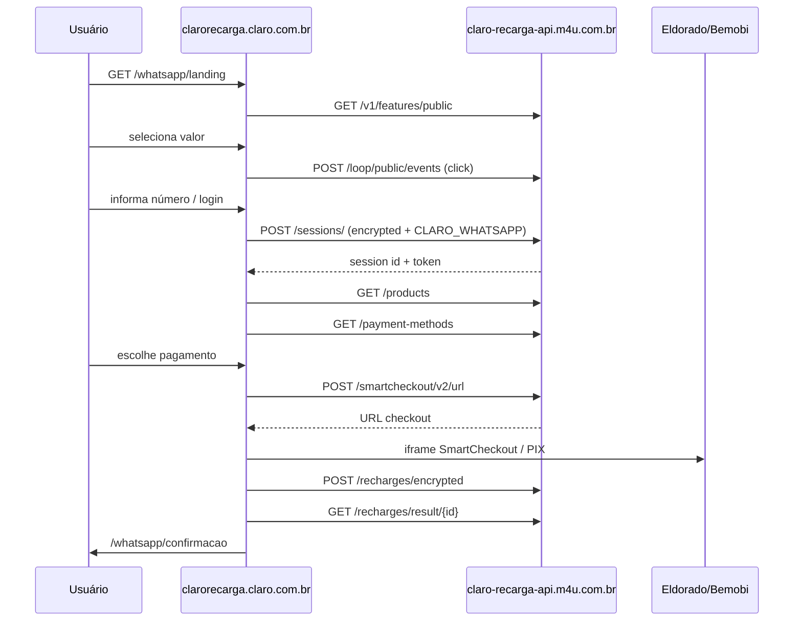

# Mapeamento — Claro Recarga WhatsApp

**URL analisada:** https://clarorecarga.claro.com.br/whatsapp/  
**Canal:** `whatsapp` / `CLARO_WHATSAPP`  
**API principal:** `https://claro-recarga-api.m4u.com.br`  
**Captura:** 2026-09-02 (Playwright + análise estática de 160 chunks JS)

---

## 1. Rotas frontend (SPA React)

O app é uma SPA. Para WhatsApp, o `:channel` resolve para `/whatsapp`.

| Rota | Observação |
|------|------------|
| `/whatsapp/` | Entrada; redireciona para `/whatsapp/landing` |
| `/whatsapp/landing` | Landing com seleção de valor |
| `/whatsapp/numero` | Informar número |
| `/whatsapp/valores` | Escolha de valor da recarga |
| `/whatsapp/selecionar-valor` | Alias interno (padrão `:channel/selecionar-valor`) |
| `/whatsapp/pagamento` | Pagamento (PT) |
| `/whatsapp/payment` | Pagamento (EN) |
| `/whatsapp/checkout` | Checkout |
| `/whatsapp/recarga` | Fluxo de recarga |
| `/whatsapp/confirmacao` | Confirmação |
| `/whatsapp/login` | Login |
| `/whatsapp/pix` | Pagamento PIX |
| `/whatsapp/pagamento-credito` | Cartão de crédito |
| `/whatsapp/pagamento-cvv` | CVV |
| `/whatsapp/pagamento-paypal` | PayPal |
| `/whatsapp/pagamento-googlepay` | Google Pay |
| `/whatsapp/pagamento-mercadopago` | Mercado Pago |
| `/whatsapp/pagamento-debitocef` | Débito CEF |
| `/whatsapp/smartcheckout` | SmartCheckout (iframe Eldorado) |
| `/whatsapp/minhas-recargas` | Histórico |
| `/whatsapp/gerenciar-recarga-programada` | Recarga programada |
| `/whatsapp/historico` | Histórico |
| `/whatsapp/home` | Home do canal |
| `/whatsapp/falha` | Erro |
| `/whatsapp/maintenance` | Manutenção |

> Rotas genéricas do mesmo bundle também existem em `/recarga/*` (web) e `/:channel/*` para outros canais (`CLARO_WHATSAPP`, `CLARO_WHATSAPP_PAY`, etc.).

---

## 2. Hosts externos usados pelo fluxo

| Host | Uso |
|------|-----|
| `https://claro-recarga-api.m4u.com.br` | **API principal** (sessão, produtos, pagamento, recarga) |
| `https://clarorecarga.claro.com.br` | Frontend estático + SPA |
| `https://eldorado.m4u.com.br` | Gateway de pagamento Eldorado |
| `https://ponte-eldorado.frontend-cdn.m4u.com.br` | Assets SmartCheckout |
| `https://ponte-pix-claro-recarga.bemobi.com/pix/` | PIX |
| `https://smart-checkout.bemobi.com/callback/itp-0009` | Callback SmartCheckout |
| `https://cc-brand.plat-m4u.io` | Branding/config cartão |
| `https://blyhax9weg.execute-api.us-east-1.amazonaws.com` | Telemetria web (Hotjar-like, só terça-feira) |
| `https://mondrian.claro.com.br` | Design system (CSS/JS/fontes) |

---

## 3. API — `claro-recarga-api.m4u.com.br`

Base: **`https://claro-recarga-api.m4u.com.br`**

### 3.1 Sessão e autenticação

| Método | Endpoint | Body / params observados | Status capturado |
|--------|----------|--------------------------|------------------|
| `POST` | `/sessions/` | `{"type":"encrypted","channel":["whatsapp","CLARO_WHATSAPP"],"origin":"login"}` | **422** sem token criptografado |
| `GET` | `/sessions/{id}` | — | requer sessão |
| `POST` | `/sessions/revalidate` | revalidação de sessão | — |
| `PUT` | `/sessions/revalidate` | revalidação de sessão | — |
| `POST` | `/sms-tokens/` | envio/validação OTP SMS | — |
| `GET` | `/tmp/token` | token temporário | — |

### 3.2 Features / configuração

| Método | Endpoint | Resposta capturada |
|--------|----------|-------------------|
| `GET` | `/v1/features/public` | `{}` (feature flags públicas) |
| `GET` | `/v1/features/` | flags por contexto |
| `GET` | `/v1/features/group/` | flags agrupadas |
| `GET` | `/v1/brand` | branding (requer params) |
| `POST` | `/v1/cc` | dados de cartão/config |

### 3.3 Cliente

| Método | Endpoint | Uso |
|--------|----------|-----|
| `POST` | `/customer/` | criar/atualizar cliente |
| `POST` | `/customer/offer` | oferta promocional |
| `GET/POST/PUT/DELETE` | `/customers/{id}` | CRUD cliente |

### 3.4 Produtos e saldo

| Método | Endpoint | Uso |
|--------|----------|-----|
| `GET` | `/products` | valores de recarga disponíveis (requer sessão) |
| `GET` | `/recharge/balance` | saldo/benefícios |

### 3.5 Pagamento

| Método | Endpoint | Uso |
|--------|----------|-----|
| `GET/POST` | `/payment-methods` | cartões/meios salvos |
| `GET/POST/DELETE` | `/payment-methods/{id}` | CRUD meio de pagamento |
| `POST` | `/payment-methods/paypal/authorize` | autorização PayPal |
| `GET/POST` | `/payment-methods/paypal/accounts` | contas PayPal |
| `GET` | `/auth/braspag/brand/{bin}` | bandeira pelo BIN |
| `GET/POST` | `/payment` | processamento pagamento |

### 3.6 Recarga

| Método | Endpoint | Uso |
|--------|----------|-----|
| `POST` | `/recharges/encrypted` | criar recarga (payload criptografado) |
| `GET` | `/recharges/{id}` | status da recarga |
| `GET` | `/recharges/result/{id}` | resultado |
| `GET` | `/recharges/recurrence/result/{id}` | resultado recorrente |
| `GET/POST/PUT/DELETE` | `/scheduled-recharges/` | recargas programadas |

### 3.7 SmartCheckout (Eldorado)

| Método | Endpoint | Uso |
|--------|----------|-----|
| `POST` | `/smartcheckout/v2/url` | gera URL iframe checkout cartão |
| `POST` | `/smartcheckout/recurrence/url` | checkout recorrente |

### 3.8 Analytics / eventos (Loop)

| Método | Endpoint | Uso |
|--------|----------|-----|
| `POST` | `/loop/public/events` | eventos de funil (sem auth) |
| `POST` | `/loop/events` | eventos autenticados |

**Exemplo capturado — `POST /loop/public/events`:**

```json
{
  "type": "click",
  "msisdn": "21999999999",
  "session_id": "8dc976c1-77da-4c61-8d8a-b5a4080618e2",
  "tags": {
    "channel": "web",
    "portal": "claro_whatsapp",
    "realm": "claro_recarga",
    "utm_source": "frontend_claro_recarga",
    "page_name": "landing_page",
    "action": "select-recharge-value",
    "transaction_amount": "2000"
  }
}
```

Resposta: `{"status":"Event sent"}` (HTTP 201)

### 3.9 Outros

| Método | Endpoint | Uso |
|--------|----------|-----|
| `POST` | `/events/checkout` | evento de checkout |
| `GET` | `/login` | fluxo login |
| `GET` | `/files/Oferta_Acessoria_Recarga_e_Oferta_Recarregue_e_Ganhe_20260303.pdf` | PDF promocional |

---

## 4. Fluxo típico de requests (WhatsApp)



---

## 5. Assets estáticos carregados na landing

| Tipo | Exemplos |
|------|----------|
| JS chunks | `/static/js/main.*.chunk.js`, `20.*` (whatsapp), `4.*`, `76.*` |
| CSS | `/static/css/main.*.chunk.css`, `20.*.chunk.css` |
| Imagens | banners Claro Controle/Flex/Prezão, bandeiras (Visa/MC/Elo/Hipercard) |
| Fontes | Mondrian Roboto + AMX |
| Monitoramento | `/newrelic.js`, GTM `GTM-TFXKRT2`, Hotjar |

---

## 6. Observações importantes

1. **`POST /sessions/` exige payload criptografado** — sem JWT/token válido da Claro retorna **422 Unprocessable Entity**.
2. Endpoints como `/products`, `/payment-methods` e `/recharges/encrypted` **dependem de sessão autenticada**.
3. O canal WhatsApp usa `channel: ["whatsapp", "CLARO_WHATSAPP"]` na criação de sessão.
4. Há variantes do canal: `CLARO_WHATSAPP_PAY`, `CLARO_WHATSAPP_PAY_LP`.
5. Arquivos brutos de captura:
   - `output/whatsapp-full-capture.json`
   - `output/whatsapp-static-routes.json`

---

## 7. Próximo passo para mapeamento completo autenticado

Para capturar **todas** as requests do fluxo até pagamento, é necessário um **link JWT válido** (`select-login?t=...`) ou número real com OTP. Com isso dá para mapear:

- resposta de `/products` (valores e IDs)
- `/payment-methods` (cartões vinculados)
- `/smartcheckout/v2/url` (URL Eldorado)
- `/recharges/encrypted` (payload final)
